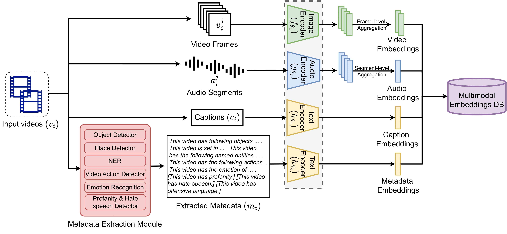
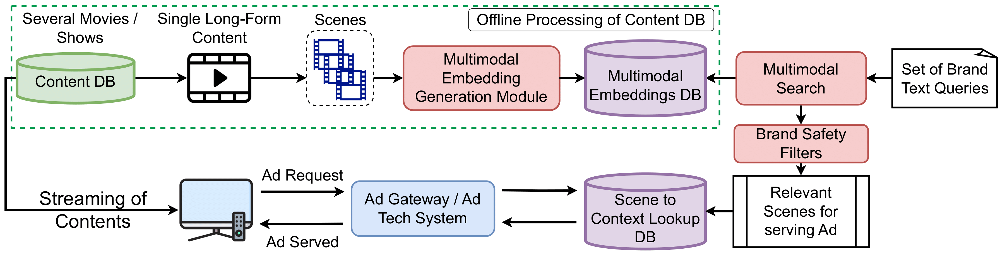

# ContextIQ: A Multimodal Expert-Based Video Retrieval System for Contextual Advertising



**[ContextIQ: A Multimodal Expert-Based Video Retrieval System for Contextual Advertising](https://arxiv.org/abs/2410.22233)**  
[Ashutosh Chaubey](https://scholar.google.com/citations?user=8g_xYb0AAAAJ&hl=en)\*,
[Anoubhav Agarwaal](https://scholar.google.com/citations?user=WcdhbqIAAAAJ&hl=en)\*,
[Sartaki Sinha Roy]()\*,
[Aayush Agrawal]()\*,
[Susmita Ghose]()\*<br>
_[WACV '25](https://wacv2025.thecvf.com/)_ | _[GitHub](https://github.com/AnokiAI/ContextIQ/)_ | _[arXiv](https://arxiv.org/abs/2410.22233)_ | _[BibTeX](https://github.com/AnokiAI/ContextIQ#citation)_

\*: Equal contribution.

This is the supplementary material for our WACV 2025 paper.

## What is ContextIQ?
ContextIQ is a multimodal, expert-based video retrieval system designed for contextual advertising. It utilizes modality-specific experts (e.g., video, audio, captions, metadata) to create semantically rich video representations, enabling precise ad placements in contextually relevant and brand-safe content. ContextIQ achieves performance comparable to or better than state-of-the-art solutions across multiple benchmarks, without relying on large datasets or joint multimodal training, and introduces a new validation dataset tailored for contextual advertising.
<br>



## Repository Structure
Here is a brief overview of the folder structure and files included in this repository:
```
.
├── datasets
│   ├── condensed_movies        # Contains data split for Condensed Movies dataset
│   ├── msrvtt                 # Contains data split for MSR-VTT dataset
│   ├── val-1                  # Released the first validation dataset of movie clips
│   └── val-2                  # Released the second validation dataset of movie clips
├── LICENSE                    # License details for the repository
├── misc
│   ├── contextiq_extraction.png    # Diagram illustrating feature extraction in ContextIQ
│   └── contextual_advertising_end_to_end.png # End-to-end system flowchart
├── README.md                  # This README file
└── supplementary
    ├── hatespeech_detection   # Prompt template for hatespeech detection using LLM
    └── video_action_recognition # Simplifying classes to 185 for the Kinetics-710 dataset
```

## Citation
If you use this dataset or code in your work, please cite:
```
@misc{chaubey2024contextiqmultimodalexpertbasedvideo,
      title={ContextIQ: A Multimodal Expert-Based Video Retrieval System for Contextual Advertising}, 
      author={Ashutosh Chaubey and Anoubhav Agarwaal and Sartaki Sinha Roy and Aayush Agrawal and Susmita Ghose},
      year={2024},
      eprint={2410.22233},
      archivePrefix={arXiv},
      primaryClass={cs.CV},
      url={https://arxiv.org/abs/2410.22233}, 
}
```

### License
The code for this work is licensed under the [Apache License, Version 2.0](https://opensource.org/licenses/Apache-2.0).

See [LICENSE](LICENSE) for more details on the code license.
